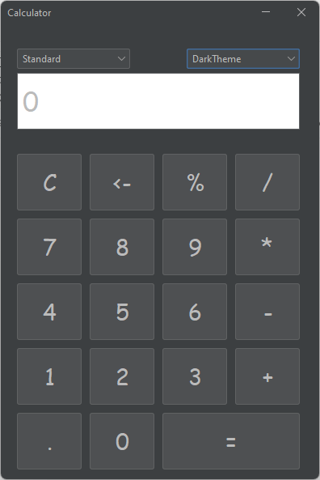
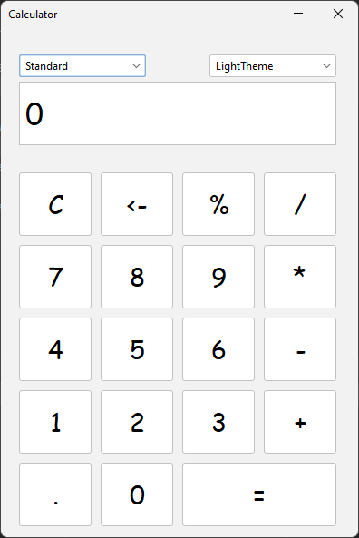

# CalculatorApp
A very basic java calculator application using **swing**

## Thanks for your support
You can hit ⭐️this repository and share it with others

### Screenshots:

### Requirements 🔧
* Java version 8 or higher.

### Installation 🔌
1. Click on **Fork** button (at the top right of page) to make a copy of this project for your own account.
2. Download the repository (project) from the download section or clone this project by typing in the bash: `git clone https://github.com/mustafapoya/CalculatorApp.git`
3. Import the cloned repository (project) in Intellij IDEA or any other IDE.
4. Run the Application

### Contributing 💡
If you want to contribute to this project and make it better with new ideas, your pull request is very welcomed.
If you find any issue just put it in the repository issue section, thank you.